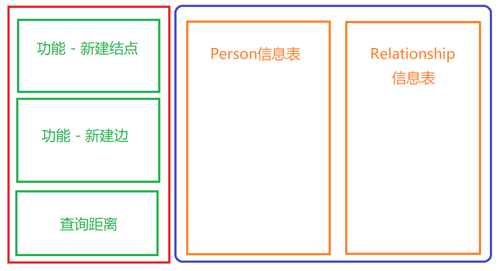
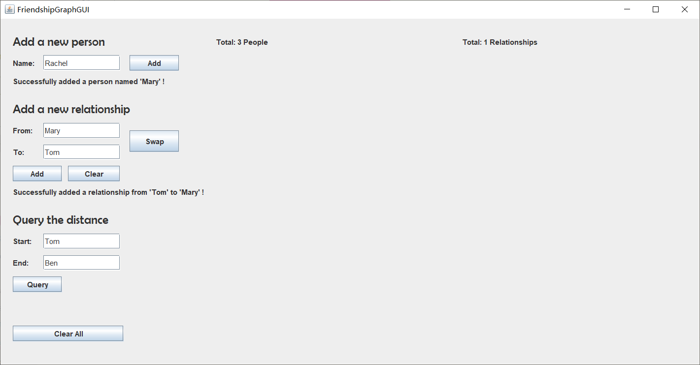
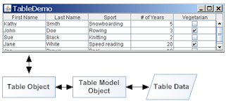
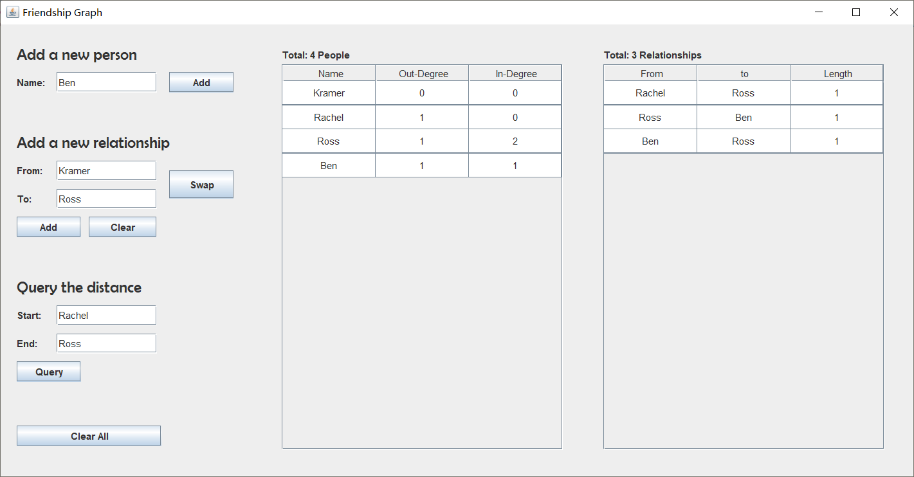

# FriendshipGraph GUI客户端开发报告

**By 1183710106 王翰坤**
**For Software Construction Lab2**

**目录**

[TOC]

本文最新版在线阅读地址：[点我](http://armeriaw.github.io/2020/03/15/java-swing-first-step-2/)

## 用Swing开发桌面应用

在软件构造Lab1 Problem3（朋友关系图）中，我尝试用Java实现一个有简单GUI（图形界面）的桌面应用程序。与Java Web应用不同，Java为我们提供了桌面GUI应用的开发工具包swing。它是Java基础类的一部分，使用纯Java实现，且无需依赖外部框架，可以说相当地「原生」了。

国内有高人写了一份详细的[Java Swing开发教程](https://blog.csdn.net/xietansheng/article/details/72814492)（以下简称「教程」），供参考。

组件按照不同的功能，可分为**顶层容器**、**中间容器**和**基本组件**。一个简单窗口的组成，如下层级结构所示：

- 顶层容器
  - 菜单栏
  - 中间容器
    - 基本组件A
    - 基本组件B

其中，顶层容器属于窗口类组件，可以独立显示，一个图形界面至少需要一个窗口；中间容器充当基本组件的载体，也可嵌套其他中间容器；基本组件是直接实现人机交互的组件。

swing包含了构建GUI的各种组件`Components`，如窗口（`JFrame`和`JDialog`）、标签
`JLabel`、按钮`JButton`、文本框`JText`等。本主题接下类的文章，我们还将用到表格`JTable`这一较为复杂的组件。

此外，swing还支持各种布局`Layout`以及各种其他特性，如与绘图工具包Graphics的互动。Lab1的小乌龟画图任务中，MIT的绘图动画就是用Graphics实现的。

## 构思功能和GUI布局

写前端代码之前，必须先要熟悉应用的功能和对应的API，并对GUI布局有初步的构思。

本应用要做的是，实现一个简单的图模型（朋友关系网络），要求支持三个主要功能：

- 新建结点
- 新建有向边
- 求解任意两节点间最短距离

这里，我们的后端API已经写好，即`Person`和`FriendshipGraph`两个类。

接下来，对GUI整体布局做个构思，如下图所示：



界面左侧为功能区，从上至下分别放置三个主要功能；界面右侧为信息区，包含两个表，用于展示目前图中的节点信息和边信息。

## GUI初步建立

### 新建窗口`JFrame`

用Swing搭建GUI，首先需要建立窗口。窗口类组件属于顶层容器。像这样新建窗口并初始化：

```java
// 新建以title为标题的窗口
JFrame frame = new JFrame(title);

// 设置窗口大小
frame.setSize(1150, 600);

// 设置默认关闭方式
frame.setDefaultCloseOperation(EXIT_ON_CLOSE);
```

代码中，`JFrame`是普通窗口类。绝大多数 swing 图形界面程序都使用`JFrame`作为顶层容器。

### 添加面板`JPanel`

有了顶层容器，接下来需要新建中间容器，用以承载、管理具体组件。这里选用普通的轻量级	面板容器组件`JPanel`：

```java
// 新建面板并设置Layout为null（绝对布局）
JPanel panel = new JPanel(null);

// 向窗口中添加panel
frame.add(panel);
```

在新建面板的时候，需要指明采用何种布局方式。以我个人愚见，Java swing所提供的布局方式基本都很难用，想做更新和修改也要费很大力气。因此，不如直接采用绝对布局，通过指定各个组件的绝对坐标来布局页面。再加上一些小技巧（如使用变量储存横纵坐标值，以便移动和修改等），绝对布局反而是省心省力的了。其他的布局方式可以参看教程。

### 添加基本组件

接下来，就需要往面板中添加组件。简单起见，我们只使用三种最基本、最常用的组件：

|     组件     |  描述  |           功能           |
| :----------: | :----: | :----------------------: |
|   `JLabel`   |  标签  |      展示文字或图片      |
| `JTextField` | 文本框 |       编辑单行文本       |
|  `JButton`   |  按钮  | 用户点击时触发特定的事件 |

其他的大部分组件都是大同小异的。这三个组件的详细教程在此：[标签教程](https://blog.csdn.net/xietansheng/article/details/74362076)；[文本框教程](https://blog.csdn.net/xietansheng/article/details/74363582)；[按钮教程](https://blog.csdn.net/xietansheng/article/details/74363221)。

#### 添加标签`JLabel`

标签`JLabel`用于展示文字或图片。刚开始用swing的时候，我花了好些时间寻找如何让文字换行。事实上，不同于某些图文编辑软件中的「文本框」，`JLabel`是不能让其内容主动换行的，且其中所有内容都应用一个格式。要想实现多行、多格式效果，只能用多个`JLabel`实现。

```java
// 新建标签，文字内容为“Add a new person”
JLabel addPersonLabel = new JLabel("Add a new person");

// 设置位置和大小
addPersonLabel.setBounds(xCoord, yCoord, 200, 25);

// 设置字体
addPersonLabel.setFont(functionTitleFont);

// 向面板添加这个JLabel
panel.add(addPersonLabel);
```

#### 添加文本框`JTextField`

文本框`JTextField`用以让用户编辑单行的文本。在本应用中，用户需要输入新结点的名称等。向面板中添加文本框的代码如下：

```java
// 新建文本框，宽度为20
JTextField personNameText = new JTextField(20);

// 设置位置和大小
personNameText.setBounds(70, yCoord, 125, 25);

// 向面板添加这个JTextField
panel.add(personNameText);
```

#### 添加按钮`JButton`

按钮`JButton`在用户点击时触发特定的事件。下面是向面板添加用于新建结点的「Add」按钮的代码：

```java
// 新建按钮，设置文字为“Add”
JButton addPersonButton = new JButton("Add");

// 设置位置和大小
addPersonButton.setBounds(210, yCoord, 80, 25);

// 添加动作监听器，设置点击按钮时要做的事
addPersonButton.addActionListener(e -> {
    // 获取文本框中的文本字符串，命名为name
    String name = personNameText.getText();
    
    // 若输入为空，忽略此次点击
    if (name.length() > 0) {
        
        // 调用FriendshipGraph类的API，尝试在图中新建名为name的结点
        if (graph.addVertex(name)) {
            // 若新建成功，改变那些显示反馈信息的标签中的文字
            addPersonInfoLabel.setText("Successfully added a person named '" + name + "' !");
            printPersonLabel.setText("Total: " + graph.getVerticesNum() + " People");
        }
        else {
            // 若新建失败，显示错误信息
            addPersonInfoLabel.setText("Error: Cannot add the person.");
        }
        // 清空文本框
        personNameText.setText("");
    }
});
// 向面板添加这个JButton
panel.add(addPersonButton);
```

像这样添加其他基本组件，即可形成一个基本的功能面板，支持新建结点、新建单向边、查询任意两结点间的距离。界面如下：



下面，我将着重探讨如何使用表格组件`JTable`和表格模型`TableModel`进行数据的展示和实时更新，并发布这个小应用的GUI部分的源代码。

## Java swing中的表格

### `JTable`简介

在Java swing中，表格`JTable`是一类较为复杂的组件，用于显示和编辑常规二维单元表。官方文档JavaDocsApi见此：[javax.swing.JTable](https://docs.oracle.com/javase/8/docs/api/javax/swing/JTable.html)。

需要注意的是，`JTable`本身并不包含或缓存数据，它只是简单地将数据可视化。表格一般会放入带滚动条的面板中，如下图所示。


### 创建简单的表格

表格一般分为两部分：标题行和数据。如下的代码便可创建出一个简单的的表格，

```java
// 标题行
String[] columnNames = {"First Name",
                        "Last Name",
                        "Sport",
                        "# of Years",
                        "Vegetarian"};

// 数据
Object[][] data = {
    {"Kathy", "Smith",
     "Snowboarding", new Integer(5), new Boolean(false)},
    {"John", "Doe",
     "Rowing", new Integer(3), new Boolean(true)},
    {"Sue", "Black",
     "Knitting", new Integer(2), new Boolean(false)},
    {"Jane", "White",
     "Speed reading", new Integer(20), new Boolean(true)},
    {"Joe", "Brown",
     "Pool", new Integer(10), new Boolean(false)}
};

JTable table = new JTable(data, columnNames);
```

但是用这种方式创建出来的表格是不能变更行列数的。还有另外一种稍灵活一些的基于`Vector`的创建方式，

```java
JTable(Vector rowData, Vector columnNames)
```

这些构造函数的优点是易于使用，但也有如下缺点：

- 它自动使各单元格处于可编辑的状态。
- 它将所有数据的类型都视为作为`String`。例如，如果想包含`Boolean`类型的数据，那么我们本可以用复选框中表示数据。 但是，如果使用前面列出的两个`JTable`构造函数，则`Boolean`类型将一律显示为字符串。 
- 它们要求所有数据要放入数组或向量中，这过于死板，不适用于某些场合。

为了解除这些限制，我们将引入`TableModel`这套接口。`TableModel`将在下一部分介绍。

### 显示表格

如前所述，我们需要把表格放入带滚动条的面板中。在swing中，`JScrollPane`就是这样一种面板。它就相当于`JTabel`的容器。

```java
// 新建表格对象
JTable personTable = new JTable();

// 新建滚动面板，用上面新建的表格示例初始化之
JScrollPane personScrollPane = new JScrollPane(personTable);

// 设定其位置和大小
personScrollPane.setBounds(350, 50, 350, 480);

// 把滚动条面板加入大面板中
panel.add(personScrollPane);
```

这样，无论表格多长，用户都能通过拖动滚动条，看到表格的全貌。

## 表格模型和相关接口

### 表格模型`TableModel`

`TableModel`、`JTable`（表格对象）和表格数据的关系如下图所示。



具体来说，`TableModel`接口指定了`JTable`用于询问表格式数据模型的方法。`TableModel`封装了表格中的各种数据，为表格显示提供数据。上面案例中直接使用行数据和表头创建表格，实际上JTable 内部自动将传入的行数据和表头封装成了`TableModel`。

常用的`TableModel`接口的实现类有两个，`AbstractTableModel`和`DefaultTableModel`。前者是一个抽象类，为大多数方法提供了默认实现，但仍需要我们手动实现如下三个方法

```java
public int getRowCount();

public int getColumnCount();

public Object getValueAt(int row, int column);
```

后者则是具体的`TableModel`接口的实现。它用`Vector`嵌套`Vector`存储单元格的值对象（里层的每个`Vector`为一行）。`DefaultTableModel` 还增加了许多方便操作表格数据的方法，例如 添加和删除行列等。

### 单元格渲染器`TableCellRenderer`

swing支持表格的自定义外观样式。为了让表格清晰、美观，我们用单元格渲染器`TableCellRenderer`指定单元格的显示样式。swing也为我们提供了这一接口的默认实现类`DefaultTableCellRenderer`。例如，如下代码即可实现简单的表格样式设置

```java
Jtable table = new JTable(...);

...

// 新建默认单元格渲染器实例tcr
DefaultTableCellRenderer tcr = new DefaultTableCellRenderer();

// 设置水平方向居中对齐
tcr.setHorizontalAlignment(JLabel.CENTER);

// 将表格的默认渲染器设置为tcr
table.setDefaultRenderer(Object.class, tcr);
```

此外，swing还为用户提供了表格监听器`TableModelListener`（监听表格单元格数据的更改，表格行列的增加和移除）、表格元素选择器`ListSelectionModel`（允许用户以不同的模式选中表格中的数据）和单元格数据编辑器`TableCellEditor`等众多组件接口。由于`FriendshipGraph`GUI客户端的表格仅作展示作用，并不希望用户通过修改表格来更改图数据，所以对这些组件不做具体介绍。

## 应用JTable展示图数据

下面，我们将尝试利用`JTable`，设计和实现图数据的展示。

### 设计展示形式

我们要展示的数据对象是朋友关系图`FriendshipGraph`类。我们可以将结点和边各用一张表展示：

- **节点图**：展示每个结点的名称、入度值和出度值
- **边图**：展示每条边的起点、终点和权值（默认为1）

### 使用JTable实现数据展示

新建结点图的`JTable`和`TableModel`对象实例：

```java
// 新建结点（Person）图
JTable personTable = new JTable();

// 表头设置为3列，分别为名称、入度和出度
Vector<Object> personTableHeader = new Vector<>() {{
    addAll(Arrays.asList("Name", "Out-Degree", "In-Degree"));
}};

// 新建表格模型，喂给personTable
personTable.setModel(new DefaultTableModel(new Vector<>(), personTableHeader));

// 将personTable装进带滚动条的面板中
JScrollPane personScrollPane = new JScrollPane(personTable);

// 设置面板的位置和大小
personScrollPane.setBounds(350, 50, 350, 480);

// 向总面板中加入装有personTable的面板
panel.add(personScrollPane);

// 根据图更新数据
updatePersonTable(personTable, personTableHeader);
```

边图的新建也是类似的。

数据更新方法`updatePersonTable`可以这样实现：

```java
// 传入表格和表格头，根据图数据更新表格内容
private void updatePersonTable(JTable table, Vector<?> header) {
    
    // 新建表格数据容器（二维Vector）
    Vector<Vector<Object>> data = new Vector<>();
    
    // 遍历图中结点
    for (Person person : graph.vertices()) {
        
        // 每个节点新建一行
        Vector<Object> line = new Vector<>();
        
        // 加入名称、入度、出度
        line.add(person.getName());
        line.add(graph.targets(person).size());
        line.add(graph.sources(person).size());
        
        // 向数据容器中接入这一行
        data.add(line);
    }
    
    // 设置表格外观格式
    beautifyTable(table);
    
    // 用新数据建立新表格模型，并将其喂给表格
    DefaultTableModel model = new DefaultTableModel(data, header);
    table.setModel(model);
    
}
```

边图数据更新的方法类似实现。

设置表格外观格式的方法`beautifyTable`可以这样实现：

```java
private void beautifyTable(JTable table) {
    
    // 新建单元格渲染器
    DefaultTableCellRenderer tcr = new DefaultTableCellRenderer();
    
    // 设置水平方向为居中对齐
    tcr.setHorizontalAlignment(JLabel.CENTER);
    
    // 设置字体
    tcr.setFont(new Font("Arial", Font.PLAIN, 18));
    
    // 将表格的默认渲染器设置为tcr
    table.setDefaultRenderer(Object.class, tcr);
    
    // 设置表格行高
    table.setRowHeight(30);
    
}
```

这个方法对于两个表格都是适用的。

最后，在按钮的动作监听器函数里，要加上表格更新的动作：

```java
addPersonButton.addActionListener(e -> {
    String name = personNameText.getText();
    if (name.length() > 0) {
        if (graph.addVertex(name)) {
            addPersonInfoLabel.setText("Successfully added a person named '" + name + "' !");
            
            // 更新表格数据
            updatePersonTable(personTable, personTableHeader);
            
            printPersonLabel.setText("Total: " + graph.verticesNum() + " People");
        }
        else {
            addPersonInfoLabel.setText("Error: Cannot add the person.");
        }
        personNameText.setText("");
    }
});
```

其他按钮也是类似的。需要注意的是，如果加边成功，需要同时更新两张表。

### 留待改进之处

这套GUI的效率是比较低的：每加一个点或一条边，就要更新整张表。

事实上，我们可以建立一个`Person -> Vector`和`Relationship -> Vector`的对应关系，实现「精准更新」，提高效率。

## 最终界面展示



## 完整GUI代码

下面给出完整的`FriendshipGraphGUI`类的代码（与两篇博文中节选的代码可能有冲突之处，如遇到请以完整代码为准）：

```java
package P2;

import javax.swing.*;
import javax.swing.table.DefaultTableCellRenderer;
import javax.swing.table.DefaultTableModel;
import java.awt.*;
import java.util.ArrayList;
import java.util.Arrays;
import java.util.Vector;

public class FriendshipGraphGUI extends JFrame {

    private final FriendshipGraph graph;

    public FriendshipGraphGUI(FriendshipGraph graph) {
        this.graph = graph;
    }

    public void run(String title) {
        JFrame frame = new JFrame(title);
        frame.setSize(1150, 600);
//        frame.setDefaultCloseOperation(DISPOSE_ON_CLOSE);
        frame.setDefaultCloseOperation(EXIT_ON_CLOSE);
        frame.setLocationRelativeTo(null);

        JPanel panel = new JPanel(null);
        frame.add(panel);
        placeComponents(panel);

        frame.setVisible(true);
    }

    private void updatePersonTable(JTable table, Vector<?> header) {
        Vector<Vector<Object>> data = new Vector<>();
        for (Person person : graph.vertices()) {
            Vector<Object> line = new Vector<>();
            line.add(person.getName());
            line.add(graph.targets(person).size());
            line.add(graph.sources(person).size());
            data.add(line);
        }
        beautifyTable(table);
        DefaultTableModel model = new DefaultTableModel(data, header);
        table.setModel(model);
    }

    private void updateRelationshipTable(JTable table, Vector<?> header) {
        Vector<Vector<Object>> data = new Vector<>();
        for (Person person : graph.vertices()) {
            for (Person to : graph.targets(person).keySet()) {
                Vector<Object> line = new Vector<>();
                line.add(person.getName());
                line.add(to.getName());
                line.add(1);
                data.add(line);
            }
        }
        beautifyTable(table);
        DefaultTableModel model = new DefaultTableModel(data, header);
        table.setModel(model);
    }

    private void beautifyTable(JTable table) {
        DefaultTableCellRenderer tcr = new DefaultTableCellRenderer();
        tcr.setHorizontalAlignment(JLabel.CENTER);
        tcr.setFont(new Font("Arial", Font.PLAIN, 18));
        table.setDefaultRenderer(Object.class, tcr);
        table.setRowHeight(30);
    }

    private void placeComponents(JPanel panel) {

        JTable personTable = new JTable();
        Vector<Object> personTableHeader = new Vector<>() {{
            addAll(Arrays.asList("Name", "Out-Degree", "In-Degree"));
        }};
        personTable.setModel(new DefaultTableModel(new Vector<>(), personTableHeader));
        JScrollPane personScrollPane = new JScrollPane(personTable);
        personScrollPane.setBounds(350, 50, 350, 480);
        panel.add(personScrollPane);
        updatePersonTable(personTable, personTableHeader);

        JTable relationshipTable = new JTable();
        Vector<Object> relationshipTableHeader = new Vector<>() {{
            addAll(Arrays.asList("From", "to", "Length"));
        }};
        relationshipTable.setModel(new DefaultTableModel(new Vector<>(), relationshipTableHeader));
        JScrollPane relationshipScrollPane = new JScrollPane(relationshipTable);
        relationshipScrollPane.setBounds(750, 50, 350, 480);
        panel.add(relationshipScrollPane);
        updateRelationshipTable(relationshipTable, relationshipTableHeader);

        JLabel printPersonLabel = new JLabel(String.format("Total: %d People", graph.verticesNum()));
        printPersonLabel.setBounds(350, 30, 150, 30);
        printPersonLabel.setHorizontalAlignment(SwingConstants.LEFT);
        printPersonLabel.setVerticalAlignment(SwingConstants.TOP);
        panel.add(printPersonLabel);

        JLabel printRelationshipLabel = new JLabel(String.format("Total: %d Relationships", graph.edgesNum()));
        printRelationshipLabel.setBounds(750, 30, 300, 30);
        printRelationshipLabel.setHorizontalAlignment(SwingConstants.LEFT);
        printRelationshipLabel.setVerticalAlignment(SwingConstants.TOP);
        panel.add(printRelationshipLabel);

        int yCoord = 25;
        int xCoord = 20;

        Font functionTitleFont = new Font("Berlin Sans FB", Font.PLAIN, 20);

        JLabel addPersonLabel = new JLabel("Add a new person");
        addPersonLabel.setBounds(xCoord, yCoord, 200, 25);
        addPersonLabel.setFont(functionTitleFont);
        panel.add(addPersonLabel);
        yCoord += 35;

        JLabel personNameLabel = new JLabel("Name: ");
        personNameLabel.setBounds(xCoord, yCoord, 80, 25);
        panel.add(personNameLabel);

        JTextField personNameText = new JTextField(20);
        personNameText.setBounds(70, yCoord, 125, 25);
        panel.add(personNameText);

        JLabel addPersonInfoLabel = new JLabel("");
        addPersonInfoLabel.setBounds(xCoord, yCoord + 30, 400,25);
        panel.add(addPersonInfoLabel);

        JButton addPersonButton = new JButton("Add");
        addPersonButton.setBounds(210, yCoord, 80, 25);
        addPersonButton.addActionListener(e -> {
            String name = personNameText.getText();
            if (name.length() > 0) {
                if (graph.addVertex(name)) {
                    addPersonInfoLabel.setText("Successfully added a person named '" + name + "' !");
                    updatePersonTable(personTable, personTableHeader);
                    printPersonLabel.setText("Total: " + graph.verticesNum() + " People");
                }
                else {
                    addPersonInfoLabel.setText("Error: Cannot add the person.");
                }
                personNameText.setText("");
            }
        });
        panel.add(addPersonButton);
        yCoord += 75;


        JLabel addRelationshipLabel = new JLabel("Add a new relationship");
        addRelationshipLabel.setBounds(xCoord, yCoord, 280, 25);
        addRelationshipLabel.setFont(functionTitleFont);
        panel.add(addRelationshipLabel);
        yCoord += 35;

        JLabel fromNameLabel = new JLabel("From: ");
        fromNameLabel.setBounds(xCoord, yCoord, 80, 25);
        panel.add(fromNameLabel);

        JTextField fromNameText = new JTextField(20);
        fromNameText.setBounds(70, yCoord, 125, 25);
        panel.add(fromNameText);
        yCoord += 35;

        JLabel toNameLabel = new JLabel("To: ");
        toNameLabel.setBounds(xCoord, yCoord, 80, 25);
        panel.add(toNameLabel);

        JTextField toNameText = new JTextField(20);
        toNameText.setBounds(70, yCoord, 125, 25);
        panel.add(toNameText);

        JButton swapFromToButton = new JButton("Swap");
        swapFromToButton.setBounds(210, yCoord - 23, 80, 35);
        swapFromToButton.addActionListener(e -> {
            String temp = toNameText.getText();
            toNameText.setText(fromNameText.getText());
            fromNameText.setText(temp);
        });
        panel.add(swapFromToButton);

        yCoord += 35;

        JLabel addRelationshipInfoLabel = new JLabel("");
        addRelationshipInfoLabel.setBounds(xCoord, yCoord + 30, 400,25);
        panel.add(addRelationshipInfoLabel);

        JButton addRelationshipButton = new JButton("Add");
        addRelationshipButton.setBounds(xCoord, yCoord, 80, 25);
        addRelationshipButton.addActionListener(e -> {
            String fromName = fromNameText.getText(), toName = toNameText.getText();
            if (fromName.length() > 0 && toName.length() > 0) {
                if (graph.addEdge(fromName, toName)) {
                    updateRelationshipTable(relationshipTable, relationshipTableHeader);
                    updatePersonTable(personTable, personTableHeader);
                    printRelationshipLabel.setText("Total: " + graph.edgesNum() + " Relationships");
                    addRelationshipInfoLabel.setText("Successfully added a relationship from '" + fromName + "' to '" + toName + "' !");
                }
                else {
                    addRelationshipInfoLabel.setText("Error: Cannot add the relationship.");
                }
            }
        });
        panel.add(addRelationshipButton);

        JButton clearRelationshipButton = new JButton("Clear");
        clearRelationshipButton.setBounds(xCoord + 90, yCoord, 84, 25);
        clearRelationshipButton.addActionListener(e -> {
            fromNameText.setText("");
            toNameText.setText("");
        });
        panel.add(clearRelationshipButton);

        yCoord += 75;

        JLabel queryDistanceLabel = new JLabel("Query the distance");
        queryDistanceLabel.setBounds(xCoord, yCoord, 280, 25);
        queryDistanceLabel.setFont(functionTitleFont);
        panel.add(queryDistanceLabel);
        yCoord += 35;

        JLabel startNameLabel = new JLabel("Start: ");
        startNameLabel.setBounds(xCoord, yCoord, 80, 25);
        panel.add(startNameLabel);

        JTextField startNameText = new JTextField(20);
        startNameText.setBounds(70, yCoord, 125, 25);
        panel.add(startNameText);
        yCoord += 35;

        JLabel endNameLabel = new JLabel("End: ");
        endNameLabel.setBounds(xCoord, yCoord, 80, 25);
        panel.add(endNameLabel);

        JTextField endNameText = new JTextField(20);
        endNameText.setBounds(70, yCoord, 125, 25);
        panel.add(endNameText);

        yCoord += 35;

        JLabel queryDistanceInfoLabel = new JLabel("");
        queryDistanceInfoLabel.setBounds(xCoord, yCoord + 30, 400,25);
        panel.add(queryDistanceInfoLabel);

        JButton queryDistanceButton = new JButton("Query");
        queryDistanceButton.setBounds(xCoord, yCoord, 80, 25);
        queryDistanceButton.addActionListener(e -> {
            String startName = startNameText.getText(), endName = endNameText.getText();
            if (startName.length() > 0 && endName.length() > 0) {
                int result = graph.getDistance(new Person(startName), new Person(endName));
                if (result == -2) {
                    queryDistanceInfoLabel.setText("Error: Cannot calculate the distance.");
                }
                else if (result == -1) {
                    queryDistanceInfoLabel.setText("'" + startName + "' and '" + endName + "' are not connected.");
                }
                else {
                    queryDistanceInfoLabel.setText("The distance { " + startName + " => " + endName + " } is " + result + " .");
                }
                startNameText.setText("");
                endNameText.setText("");
            }
        });
        panel.add(queryDistanceButton);
        yCoord += 80;

        JButton clearAllButton = new JButton("Clear All");
        clearAllButton.setBounds(xCoord, yCoord, 180, 25);
        clearAllButton.addActionListener(e -> {
            graph.clearAll();
            updateRelationshipTable(relationshipTable, relationshipTableHeader);
            updatePersonTable(personTable, personTableHeader);
            addPersonInfoLabel.setText("");
            addRelationshipInfoLabel.setText("");
            queryDistanceInfoLabel.setText("");
            fromNameText.setText("");
            toNameText.setText("");
            printPersonLabel.setText("Total: 0 People");
            printRelationshipLabel.setText("Total: 0 Relationships");
        });
        panel.add(clearAllButton);
    }
}

```

## 参考资料

- [CSDN - JTable介绍](https://blog.csdn.net/xietansheng/article/details/78079806)
- [JavaDoc - JTable](https://docs.oracle.com/javase/8/docs/api/javax/swing/JTable.html)
- [The Java™ Tutorials - How to Use Tables](https://docs.oracle.com/javase/tutorial/uiswing/components/table.html)