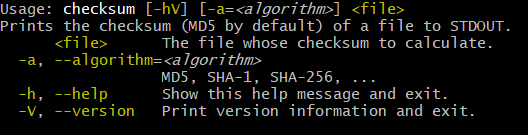
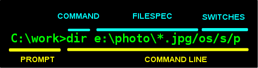

# PlanningApps CLI客户端开发报告

**By 1183710106 王翰坤**
*For Software Construction Lab3*

**目录**

[TOC]

本文最新版在线阅读地址：[上篇](http://armeria.wang/2020/05/03/java-cli-1-picocli-1/)，[下篇](http://armeria.wang/2020/05/10/java-cli-2-picocli-2/)。

在软件构造Lab3中，我尝试用[picocli](https://github.com/remkop/picocli)搭建了一个命令行交互客户端（*Command-Line Interface*，CLI）。不同于[Common CLI](http://commons.apache.org/proper/commons-cli/)，picocli的设计更为现代化，功能更为强大，[文档](https://picocli.info/)也十分丰富。

## picocli简介

picocli是一个现代库框架，适用于在 JVM 上构建命令行应用。它支持Java、Groovy、Kotlin 和 Scala。它推出的时间还不到 3 年，但是非常受欢迎，每月的下载量超过了 50 万次。Groovy 语言使用它来实现其`CliBuilder` DSL。

picocli致力于提供「最简便的方式来创建富命令行应用，使其可以在JVM上和JVM之外运行」。它提供了彩色输出、TAB键自动完成、子命令，与其他的JVM CLI相比，它还提供了一些独特的特性，比如可否定选项、重复复合参数组、重复子命令和对引用参数的复杂处理。它的源代码在单个文件中，因此我们可以选择将其作为源代码包含进来，避免添加依赖项。picocli对其丰富和细致的文档颇感自豪。



上图为picocli生成的CLI应用示例。

picocli的另一个显著特征是，它致力于让用户运行基于picoci的应用程序，而不需要将picocli作为外部依赖项：所有源代码都存在于一个文件中，以鼓励应用程序作者将其以**源代码形式**包含进来。达成这一点的工作原理是**注释类**，picocli从命令行参数初始化它，将输入转换为类字段中的强类型值。

## 准备工作

用Maven引用picocli的方式十分简单：

```xml
<dependency>
  <groupId>info.picocli</groupId>
  <artifactId>picocli</artifactId>
  <version>4.3.0</version>
</dependency>
```

以及

```xml
<plugin>
  <groupId>org.apache.maven.plugins</groupId>
  <artifactId>maven-compiler-plugin</artifactId>
  <!-- annotationProcessorPaths requires maven-compiler-plugin version 3.5 or higher -->
  <version>${maven-compiler-plugin-version}</version>
  <configuration>
    <annotationProcessorPaths>
      <path>
        <groupId>info.picocli</groupId>
        <artifactId>picocli-codegen</artifactId>
        <version>4.3.0</version>
      </path>
    </annotationProcessorPaths>
  </configuration>
</plugin>
```

## CLI应用中的基本概念

### 命令行`CommandLine`

基本的命令行模板如下：

```shell
Prompt $command param1 param2 param3 … paramN
```



- `Prompt`是命令行程序（如Shell等）为客户端提供的运行环境。
- `Command`是由客户端提供的命令。命令通常可以分为三类：
  - **内部命令**：由命令行解释器本身识别和处理，不依赖于任何外部可执行文件。
  - **包含命令**：一个单独的可执行文件，通常被认为是操作环境的一部分，并且总是包含在操作系统中。
  - **外部命令**：外部的可执行文件提供的命令。它不是基本操作系统的一部分，而是由其他的人为特定的目的和应用程序添加的。

- `param1 … paramN`是客户端提供的可选参数。参数的格式和含义取决于要执行的命令。如果是包含命令或外部命令，参数的值在操作系统启动程序时交付给程序（由命令程序指定）。它们可以是参数（Arguments），也可以是选项（Options）。

### 命令行参数

命令行参数（Command-line Argument或Command-line parameter）是程序开始时客户端提供的一系列信息。一个程序可以有许多命令行参数来标识信息的来源或目标，或者改变程序的操作。当一个命令处理器处于活动状态时，程序通常是通过输入它的名称和命令行参数（如果有）来调用的。例如，在Unix和类Unix环境中，命令行参数的一个例子是：

```shell
$rm file.s
```

这个例子中，`file.s`就是一个命令行参数，它告诉程序`rm`，执行对象是文件`file.s`。

C、C++和Java等高级语言允许程序通过在主函数中将命令行参数处理为字符串参数来解释命令行参数。

## picoli基本用法

### 选项`Option`

在picocli中，选项以单横杠`-`或双横杠`--`开头，且必须要有名字。单字母选项的含义有一些约定俗成的规定，如`-a`表示「所有的」，`-d`表示「调试模式」等，详情见[此页面](http://catb.org/~esr/writings/taoup/html/ch10s05.html)。

例如，Linux系统中，如下的`tar`命令可以实现「将`file1.txt`和`file2.txt`一起打包为`result.tar`」的功能：

```shell
$tar -c --file result.tar file1.txt file2.txt
```

其中`-c`、`--file`就都是**选项**（在picocli中用`@Option`记号标明）。前者是一个布尔型的选项（只需指明，无需参数），表示「创建一个新压缩文档」。后者则是一个需要参数的选项（使用方式为`-c=ARCHIVE`），用于设定新创建的压缩文档的文件名。此外，布尔型选项在输入时还可以叠加，以简化输入，如以下命令输入都是等价的：

```shell
$command -abcfInputFile.txt
$command -abcf=InputFile.txt
$command -abc -f=InputFile.txt
$command -ab -cf=InputFile.txt
$command -a -b -c -fInputFile.txt
$command -a -b -c -f InputFile.txt
$command -a -b -c -f=InputFile.txt
...
```

而最后的`file1.txt`和`file2.txt`则属于参数（在picocli中用`@Parameters`标明）。

在picocli中，一个命令需要封装在一个类中。上面这个`tar`命令就可以简单地封装在这个`Tar`类里面：

```java
class Tar {
    @Option(names = "-c", description = "create a new archive")
    // 添加参数的基本格式是@Annotation(属性列表 names = ..., paramLabel = ...)
    // 布尔型选项-c对应的标记变量为create
    boolean create;

    @Option(names = { "-f", "--file" }, paramLabel = "ARCHIVE", description = "the archive file")
    // -f选项对应的文件实例archive
    File archive;

    @Parameters(paramLabel = "FILE", description = "one ore more files to archive")
    File[] files;

    @Option(names = { "-h", "--help" }, usageHelp = true, description = "display a help message")
    private boolean helpRequested = false;
}
```

在主程序中，只要如下两行代码，

```java
Tar tar = new Tar();

// args为外部传入的参数
new CommandLine(tar).parseArgs(args);
```

就能够自动实现参数的解析了，且解析的结果自动存储到`tar`实例的各个对应成员变量中。例如，如果参数为

```java
String[] args = { "-c", "--file", "result.tar", "file1.txt", "file2.txt" }
```

那么以下断言都成立：

```java
assert !tar.helpRequested;
assert  tar.create;
assert  tar.archive.equals(new File("result.tar"));
assert  Arrays.equals(tar.files, new File[] {new File("file1.txt"), new File("file2.txt")});
```

注意到，输入的参数列表都是`String`类型的，但`-f`选项对应的变量却是`File`类——picocli利用`File`的相应的构造方法自动实现了`String`类到`File`类的转换。picocli可以自动转换像`File`等JDK内置类自定义类，无需任何设置；而对于自定义类，也只需在`CommandLine`实例中注册相应的构造方法，也可以让picocli自动实现这些转化，十分方便。

### 多参数选项与`arity`

有时，我们希望一个选项后面提供多个参数。`arity`属性可以实现这一点，它可以精确地控制每个选项的数量。`arity`属性既可以指定所需参数的确切数量，也可以指定具有最小和最大参数数量的范围。最大值可以是一个精确的上界，也可以是`*`来表示任意数量的参数。例如：

```java
class ArityDemo {
    @Parameters(arity = "1..3", description = "one to three Files")
    File[] files;

    @Option(names = "-f", arity = "2", description = "exactly two floating point numbers")
    double[] doubles;

    @Option(names = "-s", arity = "1..*", description = "at least one string")
    String[] strings;
}
```

需要注意的是，一旦使用了最小数量的参数，picocli将检查每个后续命令行参数，以确定它是一个附加参数还是一个新选项。

### 选项关系与分组`ArgGroups`

实际应用中，我们常会设计出一些相互冲突的选项，而另一些可能是一个整体的若干组成部分，缺一不可。这时，我们就需要对选项进行分组，并定义选项组内部的逻辑关系。

picocli中的选项组主要分为两种：**冲突**和**依赖**。

例如，冲突的选项组可以这么定义：

```java
@Command(name = "exclusivedemo")
public class MutuallyExclusiveOptionsDemo {

    @ArgGroup(exclusive = true, multiplicity = "1")
    Exclusive exclusive;

    static class Exclusive {
        @Option(names = "-a", required = true) int a;
        @Option(names = "-b", required = true) int b;
        @Option(names = "-c", required = true) int c;
    }
}
```

`Exclusive`就是一个冲突的选项组。属性`multiplicity = "1"`的含义是，`Exclusive`的三个选项中，至少且最多选1个选项。该属性的默认值是`"0..1"`，即要么全不选，要么最多选1个。`exclusivedemo`的使用说明长这样：

```
Usage: exclusivedemo (-a=<a> | -b=<b> | -c=<c>)
```

另外注意到`Exclusive`中的每个选项全都加了`required = true`属性。这个`required = true`是针对选项组`Exclusive`内部而言的，并不是说整个`exclusivedemo`都必须要选上这三个选项。

同理，依赖的选项组可以这样定义：

```java
@Command(name = "co-occur")
public class DependentOptionsDemo {

    @ArgGroup(exclusive = false)
    Dependent dependent;

    static class Dependent {
        @Option(names = "-a", required = true) int a;
        @Option(names = "-b", required = true) int b;
        @Option(names = "-c", required = true) int c;
    }
}
```

「依赖」的含义就是「同时出现」。`co-occur`的使用说明就长这样：

```
Usage: co-occur [-a=<a> -b=<b> -c=<c>]
```

此外，选项组还可以嵌套使用。例如：

```java
@Command(name = "repeating-composite-demo")
public class CompositeGroupDemo {

    @ArgGroup(exclusive = false, multiplicity = "1..*")
    List<Composite> composites;

    static class Composite {
        @ArgGroup(exclusive = false, multiplicity = "0..1")
        Dependent dependent;

        @ArgGroup(exclusive = true, multiplicity = "1")
        Exclusive exclusive;
    }

    static class Dependent {
        @Option(names = "-a", required = true) int a;
        @Option(names = "-b", required = true) int b;
        @Option(names = "-c", required = true) int c;
    }

    static class Exclusive {
        @Option(names = "-x", required = true) boolean x;
        @Option(names = "-y", required = true) boolean y;
        @Option(names = "-z", required = true) boolean z;
    }
}
```

`repeating-composite-demo`的使用说明就是：

```
Usage: repeating-composite-demo ([-a=<a> -b=<b> -c=<c>] (-x | -y | -z))...
```

这个命令类中，最外层的`Composite`是一个依赖命令组，其内部包含`Dependent`和`Exclusive`两个命令组，分别为依赖的和冲突的。

### 子命令`subcommmands`

子命令是扩充CLI应用功能的最佳方式。许多CLI应用如`apt-get`、`git`和`conda`等，都提供了一些列功能各异的子命令，它们分工明确，各司其职又相互联系，共同组成了一个完整的强大的CLI应用。

用picocli为命令类增加子命令主要有三种方式：

- 在命令类的`@Command`标记中添加子命令类
- 在命令类的方法上添加`@Command`标记，将其转变成子命令
- 在程序中调用`addSubcommand`方法，动态添加子命令

一般来说，第一种方法最为常用，且最能保证代码的整洁清楚。

例如，对于`git`命令，我们可以在`Git`命令类上添加子命令属性：

```java
@Command(
  name = "git",
  subcommands = {
      GitAddCommand.class,
      GitCommitCommand.class
  },
  ...
)
class GitCommand implements Runnable {
	...
}
```

其中，`GitAddCommand`和`GitCommitCommand`就是两个子命令类，可以定义如下：

```java
@Command(
  name = "add"
)
public class GitAddCommand implements Runnable {
    @Override
    public void run() {
        System.out.println("Adding some files to the staging area");
    }
}

@Command(
  name = "commit"
)
public class GitCommitCommand implements Runnable {
    @Override
    public void run() {
        System.out.println("Committing files in the staging area, how wonderful?");
    }
}
```

整个命令结构非常清楚。

那么，这些命令为什么要实现`Runnable`接口呢？这起到什么作用？Lab3需要实现三个相对独立的客户端，且功能繁多，应该如何整合设计？

## 可执行命令

第一步是解析命令行参数。一个健壮的实际应用程序需要处理许多场景：

- 用户输入无效
- 用户请求使用帮助（可用于子命令）
- 运行业务逻辑（可能用于子命令）
- 业务逻辑可能会抛出异常

picocli 4.0引入了`execute`方法，可以在一行代码中处理上述所有场景。例如：

```java
new CommandLine(new MyApp()).execute(args);
```

用`execute`方法，可以用相当紧凑的应用代码运行程序：

```java
@Command(name = "myapp", mixinStandardHelpOptions = true, version = "1.0")
class MyApp implements Callable<Integer> {

    @Option(names = "-x") int x;

    @Override
    public Integer call() { // business logic
        System.out.printf("x=%s%n", x);
        return 123; // exit code
    }

    public static void main(String... args) { // bootstrap the application
        System.exit(new CommandLine(new MyApp()).execute(args));
    }
}
```

注意到`MyApp`类实现了`Callable`接口，并重写了`call`方法。要通过`execute`方法运行的命令类，必须实现`Callable`（或`Runable`）接口。用`execute`方法运行命令时，就是用运行其`call`方法（或`run`方法）。

## `Root`类

Lab3中需要实现三个应用。因此，在整个程序的入口处（即在shell中用`java -jar`命令运行的）应该让用户「选择运行哪个应用」。我把这项功能放在`Root`类中。

`Root`接受三个不同的选项，分别代表三个应用。用户从三个应用中选择一个。

```java
@Command(name = "Lab3-1183710106")
public class Root implements Callable<Integer> {

    @ArgGroup(exclusive = true, multiplicity = "1")
    Exclusive exclusive;

    // 三个应用选项互相冲突
    static class Exclusive {
        // 航班应用
        @Option(names = {"-f", "--fsa"},
                paramLabel = "FLIGHT",
                description = "run FlightScheduleApp.")
        private boolean flight;

        // 高铁车次应用
        @Option(names = {"-t", "--tsa"},
                paramLabel = "TRAIN",
                description = "run TrainScheduleApp.")
        private boolean train;

        // 学习活动应用
        @Option(names = {"-a", "--aca"},
                paramLabel = "ACTIVITY",
                description = "run ActivityCalendarApp.")
        private boolean activity;
    }

    @Option(names = {"-h", "--help"}, usageHelp = true, description = "display this help message.")
    private boolean helpRequested = false;

    @Override
    public Integer call() throws Exception {
        // call方法中，根据用户的选择分别运行不同应用的main方法
        if (exclusive.flight) {
            System.out.println("Executing Flight-Schedule-App...");
            FlightScheduleApp.main(null);
        }
        else if (exclusive.train) {
            System.out.println("Executing Train-Schedule-App...");
            TrainScheduleApp.main(null);
        }
        else if (exclusive.activity) {
            System.out.println("Executing Activity-Calender-App...");
            ActivityCalenderApp.main(null);
        }
        return 0;
    }

    public static void main(String[] args) {
        // 如果参数列表为空，则显示帮助信息
        if (args.length == 0) {
            new CommandLine(new Root()).execute("-h");
        }
        else {
            new CommandLine(new Root()).execute(args);
        }
    }
}
```

这样，在shell中，只需输入指定的选项，就能选择应用运行了。例如，输入命令

```shell
$ java -jar Lab3-1183710106 -fsa
```

就能运行航班管理应用了。

## 三个实际应用类

### 通用设计

与一般CLI应用不同的是，Lab3的使用场景不是执行「单行命令式的任务」，而是需要用户**连续地**输入命令。因此，在各个App的`main`方法中，需要用`while`循环不断地接受用户输入，手动地把输入字符串分离成参数列表，然后扔给`execute`方法运行。这部分代码如下：

```java
public static void runCliApp(Scanner scanner, CommandLine cmd, String reminder) {
    // 注册构造器
    cmd.registerConverter(Timeslot.class, Timeslot::new);
    cmd.registerConverter(EntryLabel.class, EntryLabel::new);
    cmd.registerConverter(TimeDate.class, TimeDate::new);
    // 指定运行策略：只运行最后一个命令
    cmd.setExecutionStrategy(new CommandLine.RunLast());
	// 当有下一行时，不断读取下一行输入
    while (scanner.hasNextLine()) {
        // 从scanner读取下一行
        String line = scanner.nextLine().trim();
        // 如果本行为空，忽略
        if (line.length() == 0) {
            System.out.print(reminder);
            continue;
        }
        // 用String.split方法分离参数列表，分隔符为空格和制表符\t
        String[] arguments = line.split("(( +)|(\t+))+");
        // 执行命令
        cmd.execute(arguments);

        // 每行命令执行结束后暂停100毫秒，以免出现输入输出混乱
        try {
            TimeUnit.MILLISECONDS.sleep(100);
        }
        catch (InterruptedException e) {
            System.exit(1);
        }
        // 输出提示符，如" > fsa "（fsa是FlightScheduleApp的缩写）
        System.out.print(reminder);
    }
}
```

在具体应用中，为了存储信息，需要在主命令类（如`FlightScheduleApp`）中设置一个面向应用的`PlanningEntryCollection`成员（如`FlightEntryCollection`）。例如，`FlightScheduleApp`的代码可以这样编写：

```java
// 标明命令名和子命令
@Command(name = "fsa", subcommands = {
        AddEntry.class,
    	ReadFile.class,
        ManagePlane.class,
        ManageAirport.class,
        Allocate.class,
        Cancel.class,
        Run.class,
        End.class,
        Show.class
})
public class FlightScheduleApp {

    // PlanningEntryCollection成员
    private final FlightEntryCollection collection = new FlightEntryCollection();
    
    // 提示符
    private final static String reminder = " > fsa ";


    @Option(names = {"-h", "--help"}, usageHelp = true, description = "display this help message.")
    private boolean helpRequested = false;

    // protected权限的getter方法，子命令可以通过它获取collection
    protected FlightEntryCollection getCollection() {
        return collection;
    }

    public static void main(String[] args) {
        System.out.print(reminder);
        Scanner scanner = new Scanner(System.in);
        CommandLine cmd = new CommandLine(new FlightScheduleApp());
        cmd.registerConverter(FlightNumber.class, FlightNumber::new);
        // 调用runCliApp方法运行应用
        runCliApp(scanner, cmd, reminder);
    }

}
```

而子命令则需要用`@ParentCommand`标识指明父命令类，以获得其信息。例如，`AddEntry`命令的框架是这样的：

```java
@Command(name = "add-entry", aliases = "ae", description = "Add flight planning entries.")
public class AddEntry implements Callable<Integer> {

    // 指明父命令
    @ParentCommand
    private FlightScheduleApp app;

    ...

    @Option(names = {"-h", "--help"}, usageHelp = true, description = "display this help message.")
    private boolean helpRequested = false;

    @Override
    public Integer call() {
        // 获取父命令类实例的FlightEntryCollection
        FlightEntryCollection collection = app.getCollection();
        try {
            ...
            // 执行命令动作
        }
        catch (IllegalArgumentException e) {
            ...
            // 捕获异常，异常处理
        }
        
        return 0;
    }
}
```

但这就出现一个问题：前一次执行命令时存入子命令类中的数据是不会清空的，而是直接带入后一次命令的执行中。因此，更好的方法是，把`PlanningEntryCollection`中的数据用一个临时变量储存和更新，每次执行命令前，用前一次的`PlanningEntryCollection`新建`CommandLine`类，命令执行完后，再更新到`PlanningEntryCollection`中。改进后的`FlightScheduleApp`的`main`方法如下所示：

```java
public static void main(String[] args) {
    System.out.print(reminder);
    Scanner scanner = new Scanner(System.in);
    // FlightEntryCollection临时变量
    FlightEntryCollection collection = new FlightEntryCollection();
    while (scanner.hasNextLine()) {
        String line = scanner.nextLine().trim();
        if (line.length() == 0) {
            System.out.print(reminder);
            continue;
        }
        String[] arguments = line.split("(( +)|(\t+))+");
        
        // 用前一次FlightEntryCollection新建FlightScheduleApp和对应的CommandLine
        FlightScheduleApp app = new FlightScheduleApp(collection);
        CommandLine cmd = new CommandLine(app);
        
        // 注册自动构造器，设置运行策略
        cmd.registerConverter(Timeslot.class, Timeslot::new);
        cmd.registerConverter(EntryLabel.class, EntryLabel::new);
        cmd.registerConverter(TimeDate.class, TimeDate::new);
        cmd.registerConverter(FlightNumber.class, FlightNumber::new);
        cmd.setExecutionStrategy(new CommandLine.RunLast());

        // 运行命令
        cmd.execute(arguments);
        // 更新FlightEntryCollection数据
        collection = app.getCollection();

        try {
            TimeUnit.MILLISECONDS.sleep(100);
        }
        catch (InterruptedException e) {
            System.exit(1);
        }
        System.out.print(reminder);
    }
}
```

明确了上述框架之后，三个实际应用只需要往里面塞入具体的内容即可。

### 航班管理应用`FlightScheduleApp`

我为航班管理应用`FlightScheduleApp`（简写为`fsa`）设置了9个子命令：

|   子命令类名    |         子命令          |                             功能                             |
| :-------------: | :---------------------: | :----------------------------------------------------------: |
|   `AddEntry`    |    `add-entry`, `ae`    |                          添加计划项                          |
|   `ReadFile`    |    `read-file`, `rf`    |                     从文件读入航班计划项                     |
| `ManageAirport` | `manage-airport`, `ma`  |                    管理机场（增加、删除）                    |
|  `ManagePlane`  |  `manage-plane`, `mp`   |                    管理飞机（增加、删除）                    |
|   `Allocate`    |    `allocate`, `al`     |                    为某计划项分配飞机资源                    |
|      `Run`      |        `depart`         | 某一航班计划项从始发机场起飞（`master`）<br />某一航班计划项从当前机场起飞（`314change`） |
|      `End`      |  `arrive`（`master`）   |               某一航班抵达到达机场（`master`）               |
|    `Cancel`     |        `cancel`         |                         取消某一航班                         |
|     `Block`     | `arrive`（`314change`） |             某一航班抵达下一机场（`314change`）              |
|     `Show`      |       `show`, `s`       |                    展示当前计划项集合信息                    |

需要注意的几点：

- 用户通过航班号和出发日期来唯一选择一个航班计划项

- 「展示某个地点的`Board`」的功能整合在了`show`命令中（`show --board=AIRPORT_LABEL`）

- 「列出使用指定资源的所有计划项」的功能整合在了`show`命令中（`show --only-plane=PLANE_LABEL`）。这一命令将会**按起飞时间顺序**列出所有满足条件的计划项，因此没有再显式地实现「前序计划项」功能（但`PlanningEntryAPIs`中，我编写了这个功能，并通过了测试）。

- 如需使用说明，可以使用`-h`选项：

  ```shell
   > fsa -h
  Usage: fsa [-h] [COMMAND]
    -h, --help   display this help message.
  Commands:
    add-entry, ae       Add flight planning entries.
    read-file, rf       Read flights from file.
    manage-plane, mp    Manage planes. The default operation is to add a plane,
                          and you can specify '-d' option to delete one.
    manage-airport, ma  Manage airports. The default operation is to add an
                          airport, and you can specify '-d' option to delete one.
    allocate, al        Assign a plane for a flight.
    cancel              Cancel a flight entry.
    run                 A flight departs.
    block               A flight arrives at the next airport.
    show, s             Show information structures.
  ```

- 每个子命令也都有使用说明。例如，`add-entry`命令（简写为`ae`）的使用说明为

  ```shell
   > fsa add-entry -h
  Usage: fsa add-entry [-h] -a=ARRIVAL_AIRPORT_LABEL -d=DEPARTURE_AIRPORT_LABEL
                       -l=FLIGHT_NUMBER [-m=MIDDLE_AIRPORT_LABEL]
                       -t=TIMESLOT_LIST [-t=TIMESLOT_LIST]...
  Add flight planning entries.
    -a, -aa, --arrival-airport=ARRIVAL_AIRPORT_LABEL
                  arrival airport label.
    -d, -da, --departure-airport=DEPARTURE_AIRPORT_LABEL
                 departure airport label.
    -h, --help   display this help message.
    -l, --label=FLIGHT_NUMBER
                 flight number of the entry.
    -m, -ma, --middle-airport=MIDDLE_AIRPORT_LABEL
                  middle airport label (optional).
    -t, --timeslots=TIMESLOT_LIST
                 timeslot list of format (yyyy-MM-dd.hh:mm,yyyy-MM-dd.hh:mm).
                 2 timeslot should be given if you specified -m option.
  ```

下面提供一组测试示例（`master`分支，`#`开头的是注释行，请勿输入）：

```shell
# 增加若干机场
manage-airport -l Beijing -la 15.78 -lo 23.56
ma -l Nanjing -la 15.78 -lo 23.56
ma -l Hefei -la 15.78 -lo 23.56
ma -l Harbin -la 15.78 -lo 23.56

# 增加若干飞机
manage-plane -l SunXiaochuan -a 10.5 -t B787 -s 300
mp -l SunChuan -a 10.6 -t B737 -s 300
mp -l SunXiao -a 10.7 -t B747 -s 300
mp -l Sun -a 10.8 -t B777 -s 300

# 查看现有的机场列表
show --airports

# 查看现有的飞机列表
show --planes

# 增加一条航班计划项（程序会检测唯一性/地点冲突）
add-entry --arrival-airport Beijing --departure-airport Nanjing --label MU5387 --timeslot (2020-05-02.11:50,2020-05-02.11:55)
# 为该航班计划项分配飞机资源（程序会检测资源冲突）
allocate --label MU5387 -t 2020-05-02 --plane Sun

# 查看现有的计划项列表
show -entries

# 尝试删除飞机Sun，预期结果为失败（已被航班使用）
mp --delete -l Sun
# 尝试删除飞机SunChuan，预期结果为成功
mp -d -l SunChuan

# 指定航班出发
depart -l MU5387 -t 2020-05-02

# 指定航班到达
arrive -l MU5387 -t 2020-05-02

# 再增加一个航班，并分配飞机资源
ae -aa Hefei -da Nanjing -l MU5379 -t (2020-05-02.11:56,2020-05-02.11:59)
al -l MU5389 -t 2020-05-02 -p SunXiao

# 显示南京机场的信息板（仅显示计划起飞/到达时间在当前系统时间前后一小时之内的）
show -b Nanjing

# 取消航班
cancel -l MU5389 -t 2020-05-02

# 读取文件中的航班计划项
read-file -f test/apps/flight/FlightSchedule_2.txt
```

对于`314change`分支，改变命令是`add-entry`：可以通过`--middle-airport`（缩写`-ma`）选项指定一个经停机场。注意，如果指定经停机场，就必须要输入两个时间段（不能相交，后一个必须晚于前一个），例如：

```shell
# 增加带经停机场的航班计划项
ae -aa Harbin -ma Beijing -da Hefei -l MU5378 -t (2020-05-02.11:56,2020-05-02.11:59) (2020-05-02.12:56,2020-05-02.12:59)
```

### 高铁车次管理应用`TrainScheduleApp`

我为高铁车次管理应用`TrainScheduleApp`（简写为`tsa`）设置了8个子命令：

|    子命令类名    |         子命令          |               功能               |
| :--------------: | :---------------------: | :------------------------------: |
|    `AddEntry`    |    `add-entry`, `ae`    |            添加计划项            |
| `ManageStation`  | `manage-station`, `ms`  |      管理车站（增加、删除）      |
| `ManageCarriage` | `manage-carriage`, `mc` |      管理车厢（增加、删除）      |
|    `Allocate`    |    `allocate`, `al`     |      为某计划项分配车厢资源      |
|      `Run`       |        `depart`         | 某一高铁车次计划项从当前车站出发 |
|     `Cancel`     |        `cancel`         |           取消某一车次           |
|     `Block`      |        `arrive`         |  某一高铁车次计划项抵达下一车站  |
|      `Show`      |       `show`, `s`       |      展示当前计划项集合信息      |

需要注意的几点：

- 用户通过车次号和出发日期来唯一选择一个高铁车次计划项

- 展示某个地点的`Board`的功能整合在了`show`命令中（`show --board=STATION_LABEL`）

- 「列出使用指定资源的所有计划项」的功能整合在了`show`命令中（`show --only-carriage=CARRIAGE_LABEL`）。这一命令将会**按发车时间顺序**列出所有满足条件的计划项，因此没有再显式地实现「前序计划项」功能（但`PlanningEntryAPIs`中，我编写了这个功能，并通过了测试）。

- 如需使用说明，可以使用`-h`选项：

  ```shell
   > tsa -h
  arguments = [-h]
  Usage: tsa [-h] [COMMAND]
    -h, --help   display this help message.
  Commands:
    add-entry, ae        Add train planning entries.
    manage-carriage, mc  Manage carriages. The default operation is to add a
                           carriage, and you can specify '-d' option to delete
                           one.
    manage-station, ms   Manage stations. The default operation is to add an
                           station, and you can specify '-d' option to delete one.
    allocate, al         Assign carriages for a train.
    cancel               Cancel a train entry.
    depart               A train departs.
    arrive               A train arrives at the next station. A message of
                           current station and whether the train has arrived at
                           the end station or not will be given after
                           successfully executed.
    show, s              Show information structures.
  ```

- 每个子命令也都有使用说明。使用方法同`FlightScheduleApp`。

下面提供一组测试示例（`master`分支，`#`开头的是注释行，请勿输入）：

```shell
# 增加若干车站
manage-station -l Beijing -la 15.78 -lo 23.56
ms -l Nanjing -la 15.78 -lo 23.56
ms -l Hefei -la 15.78 -lo 23.56
ms -l Harbin -la 15.78 -lo 23.56

# 增加若干车厢
manage-carriage -l 001 -r 2011 -t 1 -c 300
mc -l 002 -r 2012 -t 2 -c 300
mc -l 003 -r 2013 -t 3 -c 300
mc -l 004 -r 2014 -t 4 -c 300

# 当前车站列表
show --stations

# 当前车厢列表
show --carriages

# 增加一条高铁计划项，注意车站数量需要比时间段数量恰好多1
add-entry --label G1024 --stations Beijing Nanjing Harbin Hefei --timeslots (2020-05-07.20:00,2020-05-07.20:01) (2020-05-07.20:02,2020-05-07.20:03) (2020-05-07.20:04,2020-05-07.20:05)

# 显示南京站的信息板（仅显示计划从本站出发/到达本站的时间在当前系统时间前后一小时之内的）
show --board Nanjing
# 显示合肥站的信息板
show -b Hefei

# 再增加一条高铁计划项
ae -l G1025 -s Harbin Nanjing Beijing Hefei -t (2020-05-07.20:00,2020-05-07.20:01) (2020-05-07.20:02,2020-05-07.20:03) (2020-05-07.20:04,2020-05-07.20:05)

# 取消G1024
cancel -l G1024 -t 2020-05-07

# 为G1025分配两节车厢001和002
allocate -l G1025 -t 2020-05-07 -c 001 002

# 显示当前所有计划项
show --entries

# 从起始站出发
depart -l G1025 -t 2020-05-07
# 到达第二站（状态为BLOCKED）
arrive -l G1025 -t 2020-05-07
# 从第二站出发
depart -l G1025 -t 2020-05-07
# 到达第三站（状态为BLOCKED）
arrive -l G1025 -t 2020-05-07
# 从第三站出发
depart -l G1025 -t 2020-05-07
# 到达第四站（也是终点站，状态为ENDED）
arrive -l G1025 -t 2020-05-07
```

### 学习活动管理应用`ActivityCalendarApp`

我为学习活动管理应用`ActivityCalendarApp`（简写为`aca`）设置了8个子命令：

|  子命令类名  |       子命令        |              功能               |
| :----------: | :-----------------: | :-----------------------------: |
|  `AddEntry`  |  `add-entry`, `ae`  |           添加计划项            |
| `ManageRoom` | `manage-room`, `mr` |    管理会议室（增加、删除）     |
|  `Allocate`  |  `allocate`, `al`   |     为某计划项分配材料资源      |
|    `Run`     |        `run`        |          某一活动开始           |
|    `End`     |        `end`        |          某一活动结束           |
|   `Cancel`   |      `cancel`       |          取消某一活动           |
|   `Block`    |       `block`       | 某一活动暂停（仅限`314change`） |
|    `Show`    |     `show`, `s`     |     展示当前计划项集合信息      |

需要注意的几点：

- 用户通过车次号和出发日期来唯一选择一个高铁车次计划项

- 展示某个地点的`Board`的功能整合在了`show`命令中（`show --board=STATION_LABEL`）

- `ActivityCalendarApp`没有「管理会议材料资源」子命令，因为材料`Material`类不可分辨。分配材料资源时，只能多次使用`allocate`子命令的`-m`选项逐条输入

- 如需使用说明，可以使用`-h`选项：

  ```shell
   > aca -h
  Usage: aca [-h] [COMMAND]
    -h, --help   display this help message.
  Commands:
    add-entry, ae    Add activity planning entries.
    manage-room, mr  Manage rooms. The default operation is to add a room, and
                       you can specify '-d' option to delete one.
    allocate, al     Assign a material for a activity.
    cancel           Cancel a activity entry.
    run              A activity departs.
    end              A activity finished.
    show, s          Show information structures.
  ```

- 每个子命令也都有使用说明。使用方法同前两个app。

下面提供一组测试示例（`master`分支，`#`开头的是注释行，请勿输入）：

```shell
# 添加若干会议室
manage-room -l EG001 -la 15.78 -lo 23.56
mr -l WS002 -la 15.78 -lo 23.56
mr -l MD003 -la 15.78 -lo 23.56
mr -l ZX004 -la 15.78 -lo 23.56

# 当前所有会议室列表
show --rooms

# 添加若干学习活动计划项
add-entry -l aaaa -r EG001 -t (2020-05-08.17:00,2020-05-08.17:01)
ae -l bbbb -r EG001 -t (2020-05-08.17:01,2020-05-08.17:02)
ae -l dddd -r EG001 -t (2020-05-08.16:51,2020-05-08.16:52)

# 展示会议室EG001的信息板
show --board EG001

# 为aaaa分配两份材料
al -l aaaa -t 2020-05-08 -m m01 -d d01 -r 2020-04-01 -m m02 -d d02 -r 2020-04-01

# 开始活动
run -l aaaa -t 2020-05-08

# 结束活动
end -l aaaa -t 2020-05-08

# 取消另一项活动
cancel -l bbbb -t 2020-05-08

# 展示所有计划项信息
show --entries
```

## 参考资料

- [借助Graalvm和Picocli构建 Java原生CLI应用](https://www.infoq.cn/article/4RRJuxPRE80h7YsHZJtX)
- [Github - picocli](https://github.com/remkop/picocli)
- [Wikipedia - CLI](https://en.wikipedia.org/wiki/Command-line_interface)**
- [W3schools - CLI](https://www.w3schools.com/whatis/whatis_cli.asp)
- [Wikipedia - Prompt](https://en.wikipedia.org/wiki/Command-line_interface#Command_prompt)
- [picocli文档](https://picocli.info/)
- [Baeldung - Create a Java Command Line Program with Picocli](https://www.baeldung.com/java-picocli-create-command-line-program)