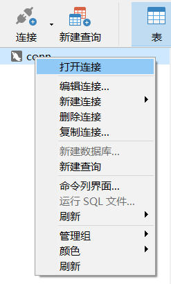

# PlanningApps 利用MySQL实现log4j日志过滤开发报告

**By 1183710106 王翰坤**
*For Software Construction Lab4*

**目录**

[TOC]

本文最新版在线阅读地址：[点我](http://armeriaw.github.io/2020/06/05/log4j-connect-mysql/)。

在软件构造Lab4中，为了实现日志过滤功能，我将log4j与MySQL数据库相连接，在本地数据库中存储日志信息。这样，就可以在MySQL中利用SQL查询语句轻松过滤日志了。

## 准备MySQL

### 下载安装MySQL

Windows 10(64bit)下载安装MySQL社区版的步骤很简单：只需在[下载页面](https://dev.mysql.com/downloads/mysql/)下载压缩包即可：


下载到本地后解压，假设解压路径为`F:\Tools\mysql-8.0.20-winx64`。接下来配置MySQL的配置文件。在解压目录下创建`my.ini`文件，写入如下信息：

```c
[client]
# 设置mysql客户端默认字符集
default-character-set=utf8
 
[mysqld]
# 设置3306端口
port = 3306
    
# 设置mysql的安装目录
basedir=F:\Tools\mysql-8.0.20-winx64
    
# 允许最大连接数
max_connections=20
    
# 服务端使用的字符集默认为8比特编码的latin1字符集
character-set-server=utf8
    
# 创建新表时将使用的默认存储引擎
default-storage-engine=INNODB
```

然后以管理员身份打开命令行工具，切换目录到安装目录。

初始化数据库：

```shell
$ .\mysqld --initialize --console
```

执行完成后，会输出 root 用户的初始默认密码。如果要修改root的密码，需要记下这个默认密码。

输入以下安装命令：

```shell
$ .\mysqld install
```

输入以下命令，启动MySQL服务：

```shell
$ net start mysql
```

### 下载安装NaviCat

NaviCat是MySQL的一个强大的可视化工具。在[NaviCat官网下载](http://www.navicat.com.cn/download/navicat-for-mysql)：


正常下载安装即可。软件免费试用14天。接下来用NaviCat添加专用于Lab4日志功能的用户和数据库。

### 添加用户


点击用户选项卡，新建用户。按下图填写信息：


其中密码设为123456。填写完毕后保存即可。

### 添加数据库与表

新建MySQL连接，


按下图配置新连接`conn`


注意用户使用`log4j`。完成后点击确定。

打开刚刚新建的连接`conn`：



然后新建数据库`lab4`，配置如下：


接着在`lab4`中新建表，


然后按下`F6`键（或点击 工具 => 命令列界面），进入命令行，输入以下代码：
```mysql
CREATE TABLE LOGS
   (LEVEL     VARCHAR(10)    NOT NULL,
    DATETIME  DATETIME       NOT NULL,
    METHOD    VARCHAR(50)    NOT NULL,
    LINE      VARCHAR(500)   NOT NULL,
    EXCEPTION VARCHAR(200)   NOT NULL,
    MESSAGE   VARCHAR(1000)  NOT NULL
   );
```

 这样就新建了一个名为`log`的表。这个表共有6列，从左至右依次代表日志级别、发生时间、方法名、位置（具体到类的行号）、异常信息（如果有抛出异常）、具体日志信息。

至此，MySQL中的准备工作就基本完成了。

## 准备`log4j`

### 设置`log4j.properties`

先在项目的`pom.xml`中添加如下这三个包的依赖：

```xml
<!-- https://mvnrepository.com/artifact/log4j/log4j -->
<dependency>
    <groupId>log4j</groupId>
    <artifactId>log4j</artifactId>
    <version>1.2.17</version>
</dependency>

<!-- https://mvnrepository.com/artifact/log4j/apache-log4j-extras -->
<dependency>
    <groupId>log4j</groupId>
    <artifactId>apache-log4j-extras</artifactId>
    <version>1.2.17</version>
</dependency>

<!-- https://mvnrepository.com/artifact/mysql/mysql-connector-java -->
<dependency>
    <groupId>mysql</groupId>
    <artifactId>mysql-connector-java</artifactId>
    <version>8.0.20</version>
</dependency>
```

然后在项目`src`目录下新建`log4j.properties`，配置`log4j`：

```properties
# PART_1
log4j.rootLogger=debug,D,DB
log4j.appender.D=org.apache.log4j.RollingFileAppender
log4j.appender.D.File=AppLog.log
log4j.appender.D.Append=false
log4j.appender.D.Threshold=DEBUG
log4j.appender.D.layout=org.apache.log4j.EnhancedPatternLayout
log4j.appender.D.layout.ConversionPattern=[%-5p] %d{yyyy-MM-dd HH:mm:ss} method:%l%n%m%n%n%n

# PART_2
log4j.appender.DB=org.apache.log4j.jdbc.JDBCAppender
log4j.appender.DB.Threshold=DEBUG
log4j.appender.DB.URL=jdbc:mysql://localhost:3306/LAB4?useSSL=false&serverTimezone=UTC
log4j.appender.DB.driver=com.mysql.cj.jdbc.Driver
log4j.appender.DB.user=lab4log
log4j.appender.DB.password=123456
log4j.appender.DB.layout=org.apache.log4j.EnhancedPatternLayout
log4j.appender.DB.layout.ConversionPattern=INSERT INTO LOGS VALUES('%p','%d{yyyy-MM-dd HH:mm:ss}','%C','%l','%throwable{short}','%m')
```

注意，与MySQL数据库连接的URL使用的是3306接口、名为`lab4`的数据库，且用户名为`lab4log`，密码为123456，这都是在之前设置好的。

再新建一个无MySQL连接的`log4j_without_mysql.properties`，把设置`JDBCAppender`的部分去掉即可：

```properties
log4j.rootLogger=debug,D,DB
log4j.appender.D=org.apache.log4j.RollingFileAppender
log4j.appender.D.File=AppLog.log
log4j.appender.D.Append=false
log4j.appender.D.Threshold=DEBUG
log4j.appender.D.layout=org.apache.log4j.EnhancedPatternLayout
log4j.appender.D.layout.ConversionPattern=[%-5p] %d{yyyy-MM-dd HH:mm:ss} method:%l%n%m%n%n%n
```

### 在App类中添加`Logger`

在App类中添加`Logger`成员：

```java
private static final Logger logger = Logger.getLogger(XxxApp.class);
```

注意这个`Logger`是`org.apache.log4j.Logger`。

如果用户需要连接MySQL，就用`log4j.properties`配置文件，否则使用`log4j_without_mysql.properties`配置文件。

```java
if (needSQL) {
	PropertyConfigurator.configure("src/log4j.properties");
}
else {
	PropertyConfigurator.configure("src/log4j_without_mysql.properties");
}

// 在JVM关闭时关闭LogManager，以免缓存丢失
Runtime.getRuntime().addShutdownHook(new Thread(LogManager::shutdown));
```

然后在各命令方法的`try`块和`catch`块中用`Logger.info()`、`Logger.error()`等方法记录操作信息和异常信息即可。

## 运行与过滤

运行App，进行一些操作（其中包含一些有意的非法操作）。MySQL中存储了操作信息和异常信息：


点击表格上方的「筛选」按钮，输入条件，即可筛选出想要的日志。例如，下面是条件为「操作时间在6月6日16:00到17:00之间的、操作类别为`ManageAirport`」的操作日志信息。可以看到，仅有四条日志符合条件。


至此，利用log4j自动记录日志并存储值MySQL，并在MySQL中实现日志筛选的功能就完成了。

## 参考资料

- [MySQL安装](https://www.runoob.com/mysql/mysql-install.html)
- [log4j - Configuration](https://www.tutorialspoint.com/log4j/log4j_configuration.htm)
- [Log4j properties file example](https://howtodoinjava.com/log4j/how-to-configure-log4j-using-properties-file/)
- [Class EnhancedPatternLayout](https://logging.apache.org/log4j/1.2/apidocs/org/apache/log4j/EnhancedPatternLayout.html)
- [Class PatternLayout](https://logging.apache.org/log4j/1.2/apidocs/org/apache/log4j/PatternLayout.html)
- [Java MySQL 连接](https://www.runoob.com/java/java-mysql-connect.html)
- [MySQL 数据类型](https://www.runoob.com/mysql/mysql-data-types.html)
- [log4j - Logging in Database](https://www.tutorialspoint.com/log4j/log4j_logging_database.htm)
- [StackOverflow - Log4j JDBCAppender to log stacktraces](https://stackoverflow.com/questions/6734044/log4j-jdbcappender-to-log-stacktraces)